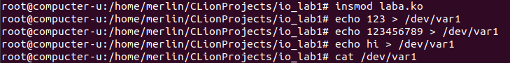
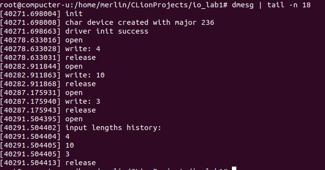
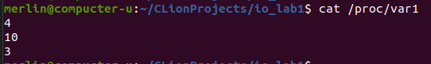

# Лабораторная работа 1

**Название:** "Разработка драйверов символьных устройств"

**Цель работы:** Получить знания и навыки разработки драйверов 
символьных устройств для операционной системы Linux

**Вариант 1**

**Тестировалось на ядре 5.13.0/Ubuntu**

## Описание функциональности драйвера

При загрузке драйвер создает символьное устройство /dev/var1 и файл
/proc/var1. При записи текста в файл символьного устройства осуществляется 
подсчет введенных символов. Последовательность полученных результатов 
(количество символов) с момента загрузки модуля ядра выводится при чтении 
файла /proc/var1.
При чтении из файла символьного устройства в кольцевой буфер ядра 
осуществляется вывод тех же данных, которые выводятся при чтении файла /proc/var1.

## Инструкция по сборке

`make` в директории с Makefile и кодом

## Инструкция пользователя

`insmod laba.ko` - загрузить драйвер в систему

`dmesg` - вывести сообщения из кольцевого буфера

`rmmod laba` - выгрузить драйвер

Поддерживаются чтение/запись в файл /dev/var1 и чтение из файла /proc/var1. 

## Примеры использования

