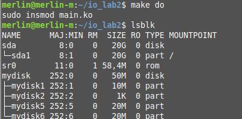

# Лабораторная работа 2

**Название:** "Разработка драйверов блочных устройств"

**Цель работы:** Получить знания и навыки разработки драйверов блочных
устройств для операционной системы Linux

**Вариант 1**

**Тестировалось на ядре 4.15/Mint**

## Описание функциональности драйвера

При загрузке драйвер создает виртуальный жесткий диск размером 50 Мбайт.
Он разбит на один первичный раздел размером 10Мбайт и один
расширенный раздел, содержащий два логических раздела
размером 20Мбайт каждый. 

## Инструкция по сборке

`make` в директории с Makefile и кодом

## Инструкция пользователя

`make do` - загрузить драйвер

`make rm` - выгрузить драйвер

`lsblk` - вывести информацию о блочных устройствах

`mkfs.vfat /dev/mydiskN` - форматирование раздела диска в vfat

`mount /deb/mydiskN /nice/dir` - монтирование раздела диска 

## Скорость передачи данных

- sda -> primary - 92.46MB/s
- sda -> logical1 - 80.80MB/s
- primary -> logical1 - 71.75MB/s
- primary -> logical2 - 83.82MB/s
- logical1 -> logical2 - 81.53MB/s

## Примеры использования

