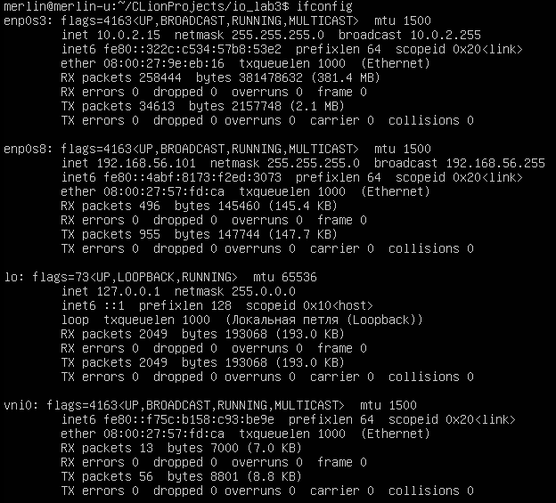
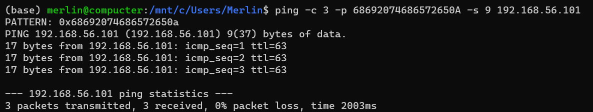
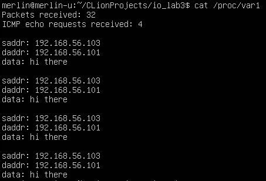

# Лабораторная работа 3

**Название:** "Разработка драйверов сетевых устройств"

**Цель работы:** получить знания и навыки разработки драйверов 
сетевых интерфейсов для операционной системы Linux.

**Вариант 1**

**Тестировалось на ядре 5.13.0/Ubuntu**

## Описание функциональности драйвера

Драйвер создает виртуальный сетевой интерфейс, перехватывающий пакеты
родительского интерфейса (задается через аргумент командной строки). 
Интерфейс сохраняет информацию о входящих ICMP echo запросах и может выводить ее
через proc-файл.

## Инструкция по сборке

`make` в директории с Makefile и кодом

## Инструкция пользователя

`insmod main.ko link=enp0s8` - загрузить драйвер с указанием родительского 
интерфейса

`ifconfig` - проверить состояние интерфейсов, посмотреть статистику

`cat /proc/var1` - чтение файла с сохраненными данными перехваченных 
пакетов

## Примеры использования

Загрузка драйвера:

Отправка запросов на родительский интерфейс:

Чтение перехваченных данных:
